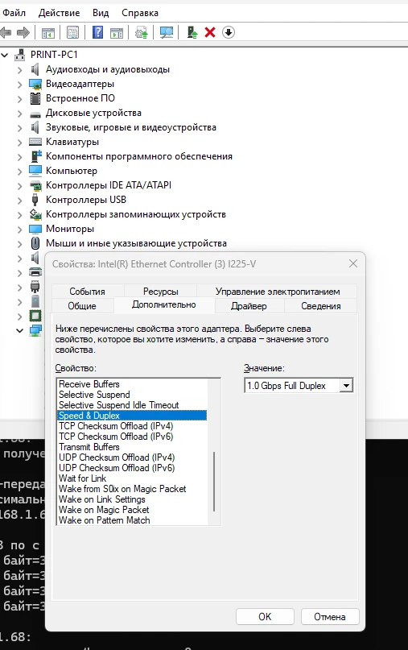

# Настройка зон безопасности Windows: устранение ограничений при работе с сетевыми ресурсами

При работе с сетевыми дисками в среде Windows часто возникают проблемы обработки файлов, обусловленные политиками безопасности системы. ОС может ограничивать функциональность сетевых ресурсов, классифицируя их как потенциально небезопасные.

### Симптомы

* Файлы с сетевых дисков блокируются приложениями или открываются в режиме защищенного просмотра.
* Невозможна интеграция сетевых каталогов в панель быстрого доступа («Избранное»).
* Системные предупреждения безопасности при запуске или копировании файлов.

### Причина

Подобное поведение вызвано встроенным механизмом зон безопасности Windows. Если система не классифицирует UNC-путь или сетевое подключение как доверенное (часто при обращении по IP-адресу или нестандартному имени хоста), ресурс попадает под политики зоны «Интернет».

### Решение проблемы

Для корректной интеграции сетевых ресурсов требуется добавить пути к локальным серверам или компьютерам в доверенную зону «Местная интрасеть» (Local intranet).

Порядок действий:

1. Открыть апплет свойств интернета: `Win + R`, команда `inetcpl.cpl`.
2. Вкладка **Безопасность** (Security) -> **Местная интрасеть** (Local intranet) -> **Узлы** (Sites).
3. Снять флажок с параметра «Автоматически определять принадлежность...» и активировать три параметра ниже (включая обработку сетевых путей UNC).
4. Кнопка **Дополнительно** (Advanced) -> ввод сетевых путей (`\\ИМЯ_ПК` или `file://ИМЯ_ПК`).
5. Кнопка **Добавить** (Add).

 

  <kbd>
    
  </kbd>
   
  <em>Рисунок 1. Конфигурация доверенных сетевых путей</em>

 

После выполнения указанных действий файловая система корректно обрабатывает сетевые ресурсы, блокировки при открытии файлов снимаются, а функционал закрепления папок в «Избранном» восстанавливается. Перезагрузка не требуется.
